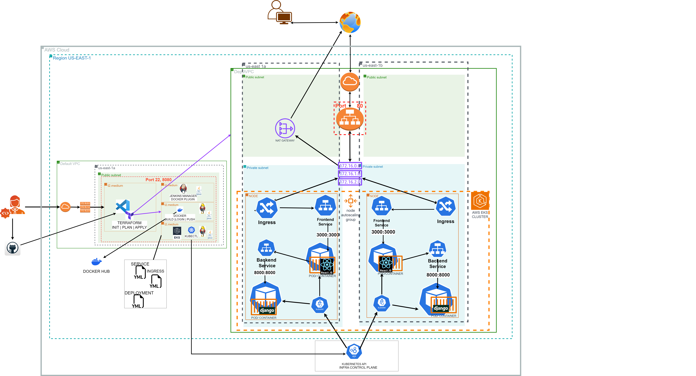
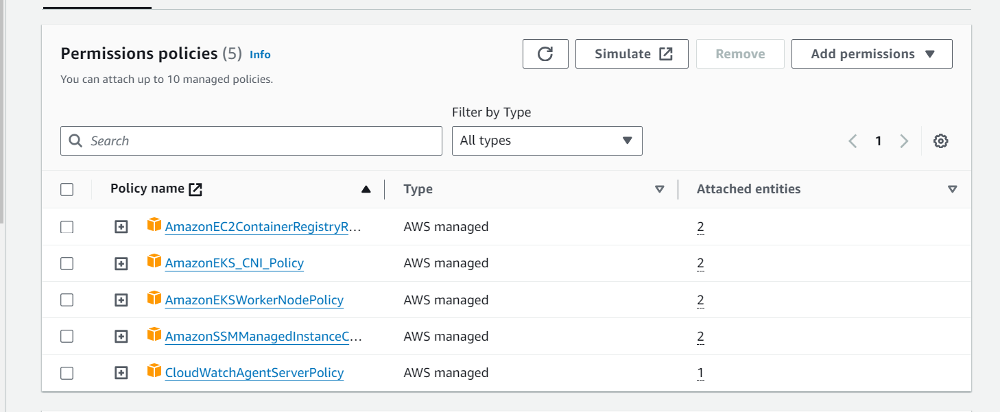
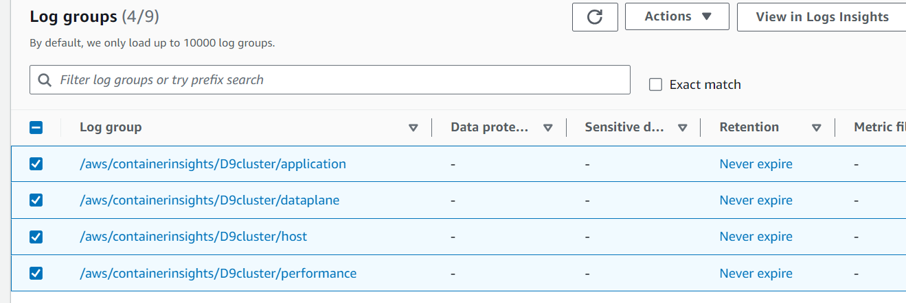
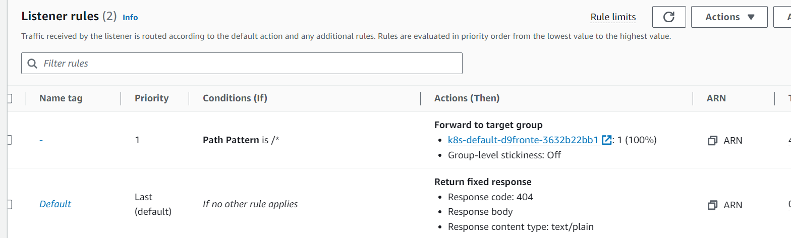
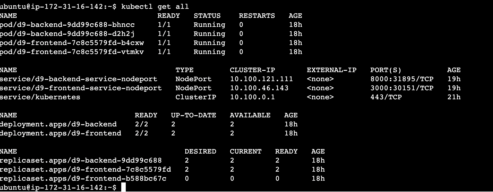
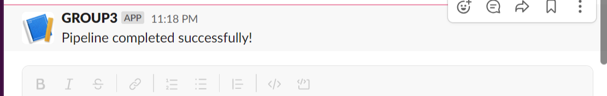
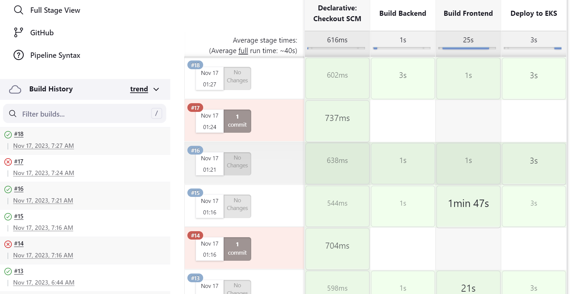
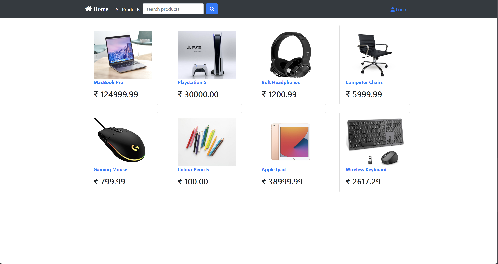

# <ins>KURA HITTERS</ins>

#### November 18, 2023

### *Project Manager:* Ethan Arteta
### *Chief Architect:* Danielle Davis
### *System Administrator:* Luis Moreno
### *Data Engineer:* Khalil Elkharbibi

_______________________________________________________
## <ins>Purpose:</ins>
____________________________________________________

&emsp;&emsp;&emsp;&emsp;	To deploy a robust and scalable E-commerce application in a cluster environment through AWS EKS(Elastic Kubernetes Service), utilizing Docker, Terraform, and Jenkins to automate the building of our infrastructure. This documentation outlines the responsibilities of each team member, the deployment process, and the subsequent data analysis for insightful decision-making.

<ins>**Application Stack:**</ins>: *Infrastructure:* AWS EKS & Terraform, *Containerization:* Docker, *CI/CD:* Jenkins, *FrontEnd:* Django, 
*BackEnd:* React, *DataBase:* SQLite

_________________________________________________________________
## <ins>Description</ins>
_____________________________________________________________

&emsp;&emsp;&emsp;&emsp;	The application follows a single tier microservices architecture as the frontend and backend are deployed within the same nodes with three logical layers. Our front end was where clients could access our Django web application in a node.js environment, our back end was connected to our React App where our services lie, and our database was stored in an SQLite file along with our application layer, which can cause security issues later. The backend is using the Kubernetes API to connect to different endpoints that lead to our microservices into our pods/containers within our private network cluster, manually configured on our EKS agent server using our yaml files– *ingress* to create port access, *service* for configurations of our app, and *deployment* to orchestrate how our deployment runs and replicates. 

&emsp;&emsp;&emsp;&emsp;	Docker containers encapsulate the images and Docker files necessary for our application and AWS EKS manages the orchestration of these containers. Instead of providing more configurations for our container, EKS takes care of that through a control plane that holds the Kubernetes API and other services for our application infrastructure. Our Jenkins and application infrastructure were automatically provisioned through Terraform, discussed further below. Jenkins was particularly important because our Jenkins file was configured to automate the building of our Docker images through Docker Hub,  deploying to our EKS cluster, and connecting to our team’s Slack channel to notify us when our Jenkins pipeline ran successfully. 

&emsp;&emsp;&emsp;&emsp;	Additionally, AWS user access and GitHub collaboration created a positive team workflow for everyone to aid in the deployment process and were proven to be instrumental in problem-solving and troubleshooting for our team.   Incorporating data analysis from database insights from our data engineer also shows how different trends and correlation analysis can create informed decision-making for a team or business. Collaboration enhances efficiency and ensures a comprehensive deployment.

_________________________________________________________
## <ins>DevOps Issues</ins>
_______________________________________________________

•	Slack URL accidentally pushed to GitHub through the Jenkins file: Had to recreate new webhooks as the whole team's webhooks were deactivated and we also had to change our variables around in our Python script within our Jenkins file so that Jenkins could recognize it and send a message through Slack.

•	Nodes were published on public subnets instead of private subnets, making them so we had to destroy previous nodes and redeploy on private subnets.

•	Authentication issues with nodes: Attempted to authenticate through SSH public keys but our Jenkins nodes needed the connection through the .pem file.

•	Encountered authentication errors were resolved by creating a new key and infrastructure.

________________________________________________________
## <ins>DataOps Issues</ins>
_______________________________________________________

### 1. Data Access and Environment Setup:

#### Issue: Difficulty in Accessing SQLite Database and Setting up Environment
- **Error Log:**
  ```
  FileNotFoundError: [Errno 2] No such file or directory: 'your_database.db'
  ```
- **Resolution:**
    1. **Identify Database Location:** Checked the current working directory to understand where Jupyter Notebook was looking for the database file.
       ```python
       import os
       os.getcwd()
       ```
    2. **Move or Upload Database:** Moved the database file to the correct location or uploaded it directly to Jupyter Notebook.
    3. **Update Connection Code:** Ensured that the database connection code reflects the correct file path.
       ```python
       import sqlite3
       conn = sqlite3.connect(c4_deployment-9/backend/db.sqlite3)
       ```

### 2. SQL Queries and Pandas Module:

#### Issue 1: Lack of Pandas Module
- **Error Log:**
  ```
  ModuleNotFoundError: No module named 'pandas'
  ```
- **Resolution:**
    1. **Install Pandas:** Used the following command to install Pandas.
       ```python
       !pip install pandas
       ```

#### Issue 2: SQL Queries Not Working Due to Table Name Mismatch
- **Error Log:**
  ```
  DatabaseError: Execution failed on sql 'SELECT * FROM incorrect_table LIMIT 5;': no such table: incorrect_table
  ```
- **Resolution:**
    1. **Check Available Tables:** Executed a query to check the available tables in the database.
       ```python
       query = "SELECT name FROM sqlite_master WHERE type='table';"
       pd.read_sql_query(query, conn)
       ```
    2. **Update Query:** Modified the SQL query to use the correct table name.
       ```python
       query = "SELECT * FROM correct_table LIMIT 5;"
       pd.read_sql_query(query, conn)
       ```

### 3. File Upload and GitHub Access:

#### Issue: Difficulty in Uploading SQLite File and Accessing it from GitHub
- **Error Log:**
  ```
  DatabaseError: Execution failed on sql 'SELECT * FROM table_name;': no such table: table_name
  ```
- **Resolution:**
    1. **Clone GitHub Repository:** Cloned the repository to access the SQLite file.
       ```bash
       git clone https://github.com/elmorenox/c4_deployment-9.git
       ```
    2. **Update File Path in Connection Code:** Ensured that the database connection code reflects the correct file path after cloning.
       ```python
       import sqlite3
       conn = sqlite3.connect(c4_deployment-9/backend/db.sqlite3)
       ```

### 4. Data Output Interpretation:

#### Issue: Difficulty in Interpreting Output Data
- **Error Log:**
  ```
  Empty DataFrame
  Columns: [cid, name, type, notnull, dflt_value, pk]
  Index: []
  ```
- **Resolution:**
    1. **Review SQL Query:** Checked and modified SQL queries to ensure correctness.
    2. **Inspect Data:** Reviewed the available data in the tables to ensure it matched the criteria of the queries.

### 5. Exchange Rate and Currency Conversion:

#### Issue: Need for Currency Conversion from Rupees to USD
- **Error Log:**
  ```
  ValueError: invalid literal for int() with base 10: 'actual_revenue'
  ```
- **Resolution:**
    1. **Inspect Data Types:** Checked the data types of columns involved in the conversion.
       ```python
       result.dtypes
       ```
    2. **Correct Data Type:** Ensured the data type is suitable for conversion, changing it to a numeric type.

__________________________________________________________
## <ins> Project Organization:</ins>
____________________________________________________________

### <ins>Steps:</ins>


1.	**<ins>Project manager created team workspace:</ins>** 

	- Created a free account and [Jira Board](https://www.atlassian.com/software/jira)

	- Created main GitHub repo → Go to *Settings* → Select *Collaborators* → Select *Add people* to add team members so we could all work on one repo and work on our Jenkins pipeline together and separately if needed.


<ins>Git Commits taken by the team</ins>:

* *git clone* - Used VS code editor to easily make changes to my remote repo on GitHub

* *cd .git, nano config* - Added GitHub URL for the main repo in my .git config file to give VS code permission remote repo

* *git branch second* - to create and make changes in the second branch 

* *git merge* - to resolve any merging conflicts and resolve files 

* *git add .*  - to update changes in each branch

* *git commit -m "message"* - to finalize changes to repo with message description

* *git push* - push changes back to remote GitHub repo

___________________________________________________________________________

2.	**<ins>Chief architect managed system design and infrastructure:</ins>** 

	

**<ins>Configured *staging environment* with [Jenkins infrastructure](main.tf) and CI/CD pipeline stages with [Jenkinsfile](Jenkinsfile):</ins>**

**[Jenkins](jenkins-deadsnakes2.sh) manager server:** Installed with Jenkins and the latest version of Python 3.9 package to create the necessary python environment for the application. This main server sends the necessary build scripts and files to each agent/virtual machine reducing resource contention and configuration drift.

**<ins>Stage: Environment variables:</ins>**

*DOCKERHUB_CREDENTIALS** *(to connect Jenkins pipeline to our docker image storage tool to create/run containers created for deployment)

*AWS_EKS_CLUSTER_NAME** (so that our application could deploy to our pre-existing cluster environment in our private network)
        
*AWS_EKS_REGION** (to create cluster in us-east-1 region)*
        
*KUBE_MANIFESTS_DIR** (to direct EKS commands to deploy using the yaml files in this directory)*

**<ins>Stages: *Build backend* & *Build frontend*:</ins>**

**[Docker](dockeragent2.sh) agent server:** The docker agent receives the job execution request from the main server when our pipeline initiates when the Docker build stages are triggered through Jenkins when we select “Build Now”: 

 *Docker build* to create images described within our Docker files for the application’s front-end and back-end.

 *Docker login* to provide access to our Docker Hub account which is instrumental in connecting our application image to our Kubernetes pods/containers.

 *Docker push* to push the latest image version back to Docker Hub so that our changes to our main repo are reflected correctly in our application code.

**<ins>Stage: Deploy to EKS:</ins>**

**<ins>Manually configured Cluster and node groups from [EKS](eks-jre.sh) agent server:</ins>** 

•	The EKS agent server triggers the necessary job to *Deploy* when triggered in the Jenkins pipeline. It also acts as the bastion host and as a gateway or entry point into our private network where our EKS cluster = *eksctl create cluster DepCluster9 --vpc-private-subnets=”pri_subnet,pri_subnet”  --vpc-public-subnets=”pub_subnet,pub_subnet” --without-nodegroup* and node groups were provisioned separately in order to customize out node groups =  * eksctl create nodegroup --cluster DepCluster9 --node-type t2.medium --nodes 2*.

•	I also manually configured the ALB controller for traffic management and the CloudWatch agent on the server for monitoring (explained further below).

**<ins>Stage: Slack notification:</ins>**

*<ins>Found documentation on the Slack API and utilizing a webhook URL to broadcast messages to the team on our designated Slack channel:</ins>*

•	For Slack access on Jenkins: Configured credentials as a “secret text” like how we enter our AWS keys. Defined and set variables for slack webhook URL within Jenkinsfile to avoid directly hard coding and leaking our URL onto GitHub again. 


____________________________________________________________________________________________________________
**<ins>Application network infrastructure created in a new VPC in [appinfra.tf](intTerraform/appinfra.tf):**

•	1 VPC *(avoids any network conflicts, flexible network design, & isolates EKS cluster from other resources in AWS account)*

•	2 AZs *(increases fault tolerance and availability for users and clients)*

•	2 Public subnets *(utilized one to house our NAT gateway, we configure 2 when creating our ALB because AWS requires two so that it can replicate our ALB in the second public subnet for redundancy)*

•	2 Private subnets *(our private network held our EKS cluster and its necessary components)*

•	Internet Gateway *(utilized to access incoming traffic from the internet to our application for HTTP requests)*

•	Nat Gateway *(utilized to flow outbound traffic out to our application for HTTP responses )*

•	2 route tables *(private route table to connect to the NAT gateway, public route table to connect the public subnets to the application load balancer)*


______________________________________________________________________________________________________
**<ins>Necessary pre-configurations to be done on EKS cluster to provision the ALB controller:</ins>**

* Provided permission to my AWS account to interact with our cluster through *OpenID*

* Added new tags: the key being: “kubernetes.io/role/elb” and the value: “1” so that  Kubernetes could identify the suitability of our public subnets to host our application load balancer. 

* Downloaded iampolicy.json file in our EKS cluster to define what is allowable and what isn’t when accessing our application. 

* Downloaded “AWSLoadBalancerControllerIAMPolicy to give permission to my cluster to use my ALB controller.

* Create a service account that is used to control access to our ingress controller to interact with our ALB in our EKS cluster.

* Created certificate manager to secure the traffic from clients and associated ingress (incoming traffic) controller with the associated domain name that will be created to access our application through the load balancer.

* List of polocies under the AWSLoadBalancerControllerRole on our worker nodes (2 instances configured to spin back up if ever terminated:


 ______________________________________________________________________________________________________
**<ins> Configured ALB controller:</ins>**

•	Downloaded v2_4_5_full.yaml file from GitHub: 
```wget https://github.com/kubernetes-sigs/aws-load-balancer-controller/releases/download/v2.4.5/v2_4_5_full.yaml``` which acts as our *IngressClass.yaml* file to define the ingress controller we’re creating to handle the ALB controller resource to balance traffic load. *changed cluster name to our EKS cluster*

•	Configure the Kubernetes ingressclass.yaml file to our cluster by running: ```kubectl apply -f v2_4_5_full.yaml```

•	Lasty, I ran: ```kubectl apply -k "github.com/aws/eks-charts/stable/aws-load-balancer-controller/crds"``` to apply Kubernetes resources that we download from an ingressclass.yaml file with pre-configured resource definitions so that AWS can manage the resources necessary to run the ALB efficiently.

</ins>
______________________________________________________________________________________________________
**<ins>Installed cloudwatch agent:</ins>** 

*<ins>Found documentation for easy installation on AWS:</ins>*

•	The following command attaches a role policy to my cluster by updating the policies under my IAM role to include the *CloudWatchAgentServerPolicy*:
  
```aws iam attach-role-policy \--role-name *name of IAM policy on worker-nodes* \ --policy-arn arn:aws:iam::aws:policy/CloudWatchAgentServerPolicy```

* <ins>The following command installs the necessary add-on for CloudWatch monitoring to observe and function properly:</ins>*

```aws eks create-addon --cluster-name * pre-existing cluster-name* --addon-name amazon-cloudwatch-observability```

Cloudwatch log groups:


_______________________________________________________________________


3.	**<ins>System administrator configured Docker and Kubernetes files:</ins>**

**</ins>The [Dockerfile.frontend](Dockerfile.frontend)</ins> contains the frontend image:**

•	The image contains a React application and its node dependencies.

•	The base image is node:10 which is the version the application needs

•	The image copies the application from the ```frontend``` directory in this repository

•	npm dependencies are installed

•	The application is exposed on port 3000 

•	The cmd to start the application is 
```CMD ["npm", "start"]```

______________________________________________________________________________________________________
**<ins>The [Dockerfile.backend](Dockerfile.backend)</ins> contains the backend image:**

•	The image contains a Django REST API and its pip dependencies. The backend container is consumed by the frontend containers

•	The base image is python:3.9, the python version the application expects

•	The backend application is downloaded from a GitHub repository

•	The ```WORKDIR``` is set to ```/app/c4_deployment-8/backend``` to be in the directory where the backend application lived

•	pip dependencies are installed

•	Data is migrated into the database

•	The cmd to start the application is 
```CMD ["python", "manage.py", "runserver", "0.0.0.0:8000"]```

______________________________________________________________________________________________________
**<ins>Created AWS user accounts (user IAM roles) for team members:</ins>** 

•	Create users for each team member

•	The authorization for each user is copied from the System Admin

•	Authentication is set by the System Admin and configured to prompt new users for a password on first login

______________________________________________________________________________________________________
**<ins>Provided AWS & Docker credentials for Jenkins:</ins>**

**For AWS:**

•	The ```Deploy to EKS``` stage in the Jenkins pipeline needs AWS credentials to execute the ```kubectl apply``` that creates the Kubernetes objects in our EKS cluster. The AWS access key and secret keys are stored as secret text in the Jenkins credentials utility. The credentials are then called by the Jenkinsfile and passed to the ```kubectl``` command in the Jenkinsfile.

**For Docker:**

•	The Jenkins pipeline needs credentials from the Docker Hub where the images for the frontend and backend. Both ```Build Frontend``` and ```Build Backend``` steps use the Docker Hub username and token to login to Docker Hub and push the built image to the repository.

•	Provisioned the agent nodes: The nodes for our cluster are provisioned in the private subnets as a measure of security. Neither the frontend or backend pods are directly accessible. The frontend ingress receives traffic only through the load balancer. The frontend containers access the backend through the backend service. 

______________________________________________________________________________________________________
**<ins>Kubernetes manifest:</ins>**

<ins>The Kubernetes objects that are included in the Cluster are an ingress, 2 services, and 2 deployments for each node:</ins>

•	The [ingress.yaml](/KUBE_MANIFEST/ingress.yaml) defines the ingress that received traffic from the load balancer and allows it into the node. The Ingress then forwards traffic to the frontend service listening on port 3000.

<ins>The [service.yaml](/KUBE_MANIFEST/service.yaml) includes the services for both the backend and frontend. Each service forwards traffic to its respective containers defined in the deployment.yaml:</ins>

- The frontend service listens on port 3000 and forwards to port 3000 of the frontend containers
    
- The backend service listens on port 8000 and forwards to port 8000 of the backend containers

* EKS takes care of many services necessary for our application to work including our target zones so that our ALB gets automatically directed to the ones opened in our services:


    
<ins>The [deployment.yaml(/KUBE_MANIFEST/deployment.yaml) defines the configurations for the containers based on the backend and frontend images:</ins>

- The frontend image is configured to point to the backend service ``` "proxy": "http://d9-backend-service-nodeport:8000" ```

- There are two containers per deployment to distribute that of the application between two replicas. This also implements some redundancy in case the health of  one of the containers is ina failing state, there is another to receive traffic while a replacement is spun back up



- Slack notification of successful Jenkins pipeline:
  





____________________________________________________________________________________________________________________________________________

## 4.	<ins>Data Engineer sifted through the database and provided visualizations that aided in:</ins>**
_______________________________________________________________________________________________________

•	**Identifying Trends:** Discovering recurring patterns or trends in data over time, which can be useful for predicting future behavior.

•	**Correlation Analysis:** Determining relationships between different variables in the dataset to understand how changes in one variable may impact another.

•	**Anomaly Detection:** Recognizing unusual patterns or outliers in the data that may indicate errors, fraud, or unexpected behavior.

•	**Customer Behavior Analysis:** Understanding how customers interact with a product or service, which can inform marketing strategies, product development, and customer satisfaction initiatives.

•	**Forecasting:** Using historical data to make predictions about future trends, demand, or performance.

•	**Segmentation:** Grouping data into distinct segments based on certain characteristics to tailor strategies or interventions to specific subpopulations.

•	**Performance Metrics:** Evaluating the performance of a system, process, or product based on key metrics and indicators.

•	**Root Cause Analysis:** Investigating the underlying causes of a problem or issue to address it at its source.

•	**Sentiment Analysis:** Analyzing text data to understand the sentiment expressed by users, customers, or stakeholders

•	**Optimization Opportunities:** Identifying areas where improvements can be made to enhance efficiency, reduce costs, or increase effectiveness. 

______________________________________________________________________________________________________
## 5. **<ins>Conclusion & Optimization</ins>**
________________________________________________________

<ins>Successful Deployment of our E-commerce application:</ins>



&emsp;&emsp;&emsp;&emsp; The production environment for our deployment was created within Amazon’s Elastic Kubernetes Service, using Kubernetes, an open-source container orchestration tool. One of the benefits of using Kubernetes over a tool like Elastic Container Service is that K8s infrastructure can more easily be moved to another cloud provider that supports Kubernetes, which is also easily integratable with third party tools that aren’t provided by AWS. EKS also manages many processes and configurations to regulate the state of our cluster environment from its control plane such as an auto scaling group, DNS server, and API server.

&emsp;&emsp;&emsp;&emsp; The EKS cluster was placed in the VPC’s private subnets adding a measure of security as the pods aren’t able to receive traffic from anything outside of the cluster. The load balancer that sits outside of the cluster and in the VPC receives traffic from the internet and routes it to the nodes in the private subnets. The nodes are able to initiate traffic to the internet and receive responses through the NAT Gateway in the public subnet. The ingress in each node configures the connection from the load balancer to the target groups and security groups so we have less management responsibilities over our network mapping thanks to EKS. 

&emsp;&emsp;&emsp;&emsp;  EKS further enhances security over our application infrastructure with our bastion host/EKS agent server by connecting the kubelet in our nodes to the Kubernetes API, making it an optimal platform choice in load balancing, scaling, and managing accessibility of our microservices in our application. Additionally, as a cost saving measure, the nodes are on t2.medium EC2 instances rather than the default m5.large nodes that the ```eksctl create cluster``` command provides. 

______________________________________________________________________________________________________
**<ins>Different ways to improve optimization:</ins>**

**Fault tolerance:**

•	Implement robust monitoring tools to detect issues in real-time. Automated alerts and notifications can help identify and address faults promptly.

•	Use databases that offer fault-tolerant features, such as automatic failover, replication, and backup mechanisms.

**Resiliency:**

•	Implement retry mechanisms for critical operations, allowing the system to recover from transient failures without human intervention.

•	Isolate components of our system to contain failures and prevent them from cascading to other parts of the application.

**Redundancy:**

•	Deploy your application across multiple availability zones (AZs) to ensure redundancy. If one AZ goes down, the application can continue running in another.

•	Replicate critical data across multiple servers or regions to prevent data loss in the event of hardware failure.

•	Regularly back up your data, and establish procedures for quick and reliable data restoration in case of data corruption or loss.

•	Maintain hot standby systems that can take over immediately if the primary system fails. This minimizes downtime.

**Scalability:**

•	Implement auto-scaling features that automatically adjust the number of resources based on demand. This ensures efficient resource utilization and cost-effectiveness.

•	Use CDNs to distribute static content globally, reducing the load on your servers and improving the scalability of content delivery.

•	Consider serverless computing models, such as AWS Lambda, to automatically scale based on demand without the need for manual intervention.

____________________________________________________________________________

The project organization was structured with precision and meticulous planning, showcasing the steps taken by the Project Manager, Chief Architect, and System Administrator in creating a collaborative workspace, managing system design and infrastructure, and configuring essential credentials for Jenkins and AWS access. The deployment pipeline, orchestrated by Jenkins, automated the build and deployment processes, ensuring efficiency and reliability. The Data Engineer's contributions from anomaly detection to customer behavior analysis,  a crucial role in enhancing the overall deployment. Our deployment not only reflects technical prowess but also highlights the importance of a well-coordinated and skilled team in achieving successful outcomes in complex projects.
